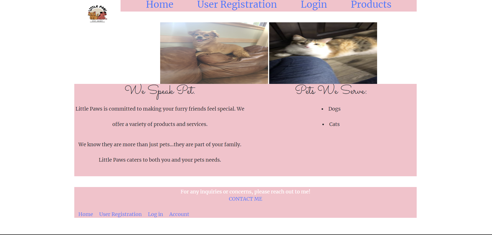
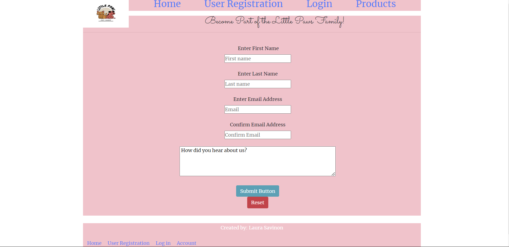
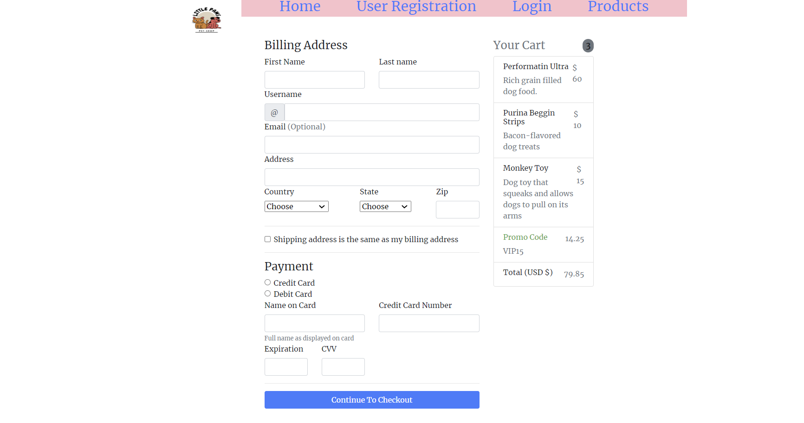

# capstone--littlepaws

Finished product.

I created 5 different pages along with a navigation bar that links all of the pages to the index page. This is website is called Little Paws Pet Shop. The index page starts off with a brief description of the website along with a picture. The next pages include a registration and login for users to enter their information to sign up to become part of the Little Paws Family. The registration was created using bootstrap form as well as the login.

The registration page asks users for their full name, email address, and prompts users to answer a question in a text box. The login page only asks users for their email address and password. The products page displays 6 bootrap cards that show the store's most popular items which are pet food, toys, and treats. I included 1 from each category in regards to cats and dogs. The pet store is limited to only servicing cats and dogs as mentioned in the index page. Each bootrap card has a 'Add to Cart' button in the buttom that when pressed created the reaction that items have been added to the cart.

Lastly, the checkout page is created with bootstrap. This displays a form which user provide their full name, mailing address, and payment details. There is also a sample table that shows three items from our products page to reflect something a customer would pay pay for.

I included images in the index and products pages. I have custom font added into the website with a pink background to make it visually more appealing.

\*\*Previously uploaded file because Github was not reflecting commits via VS Code. UPDATE: I was finally able to link my VS code into Github.

Website Preview:
Index: 
Index: 
Index: 
Index: 
Index: 
